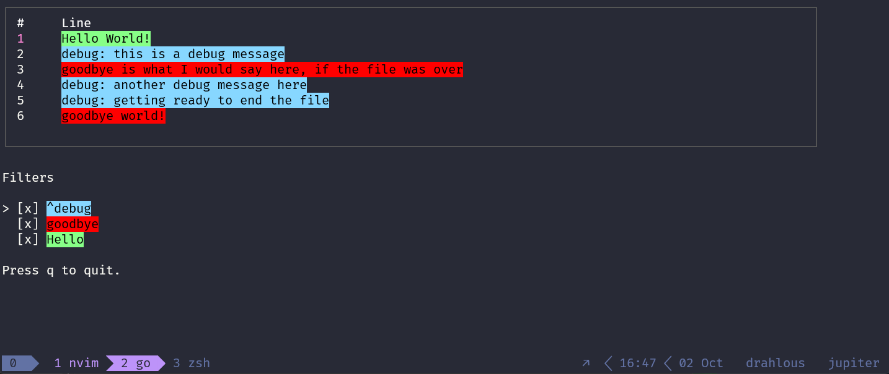

# skim

Tool for skimming plaintext log files, like TextAnalysisTool or glogg.

## Screenshots



## Usage

```text
Usage of skim:
  -filter string
        supply the path to a TAT filter file (default "./examples/simple_filter_two.tat")
  -log string
        supply the path to the input log file (default "./examples/simple_longer.log")
```
