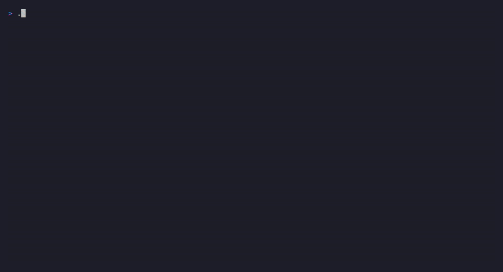
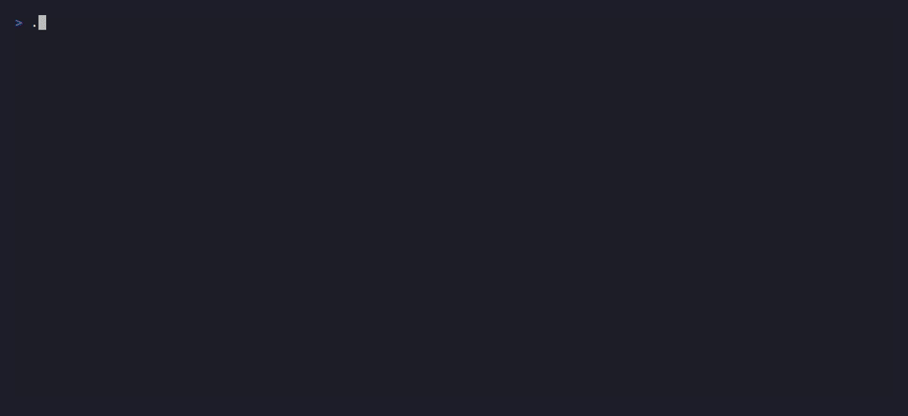

# skim

[](https://github.com/Drahlous/skim/actions/workflows/go.yml)
[](./LICENSE)

**skim** is a terminal UI for skimming plaintext log files. It renders a log alongside a set of purpose-built, regex-driven filters, so you can cut straight through the noise to the entries that actually matter — whether you're replaying a saved investigation or narrowing in on something live.

skim reads filter files in the same XML format used by [TextAnalysisTool.NET](https://textanalysistool.com/) (`.tat`), so existing TAT filter sets work as-is.



## Why skim

Long logs bury the handful of lines you actually care about under thousands you don't. skim is built around two ideas:

- **Reusable filters.** Save a `.tat` filter file once — matching the error signature, request ID, or subsystem you care about — and reuse it every time that scenario comes up again.
- **Live iteration.** When you don't yet know exactly what you're looking for, edit a filter's regex directly in the UI and watch matches update immediately, without leaving the log or restarting skim.

Every matching line is colored by the filter that matched it, and lines that don't match anything can be hidden entirely with one keystroke, turning a wall of text into just the lines relevant to your question.

## In action

Editing a filter's regex opens it in `$EDITOR`; saving and quitting recompiles it and updates the log view immediately, no restart required:



This is the same investigation walked through step by step in the [tutorial](./docs/tutorial-triage-a-log.md), using the log and filter files in `examples/tutorial/`.

## Features

- Color-coded highlighting of log lines, driven by regex filters you control
- Hide/show lines that don't match any enabled filter, with a live `showing X/Y lines` status indicator
- Live regex editing in `$EDITOR`, applied to the running view immediately
- Toggle filters on/off and case-sensitivity per filter, without editing the filter file by hand
- Fully rebindable keybindings, persisted across sessions
- Compatible with existing TextAnalysisTool.NET `.tat` filter files

## Installation

Download a prebuilt binary from the [Releases](https://github.com/Drahlous/skim/releases) page, or build from source:

```sh
git clone https://github.com/Drahlous/skim.git
cd skim
go build -v ./...
```

This produces a `skim` binary in the current directory. Requires Go 1.18+.

## Quick start

```sh
./skim -filter <path/to/filters.tat> -log <path/to/logfile.log>
```

Or, to try it immediately with the bundled example filter and log:

```sh
go run .
```

```text
Usage of skim:
  -filter string
        supply the path to a TAT filter file (default "./examples/simple_filter_two.tat")
  -log string
        supply the path to the input log file, or - to read from stdin (default "./examples/simple_longer.log")
```

`-log -` reads the log from stdin instead of a file, so skim can sit at the end of a pipeline. skim reads all of stdin up front before the UI opens, so this works with a finite stream — not `-f`/follow mode, which never ends and would leave skim waiting forever for EOF:

```sh
kubectl logs my-pod | skim -log - -filter <path/to/filters.tat>
```

## Documentation

- **[Getting started](./docs/getting-started.md)** — the two panes, moving around, and the core hide/show workflow
- **[Filter files](./docs/filter-files.md)** — the `.tat` XML format, and how to write and edit filters
- **[Keybindings](./docs/keybindings.md)** — the full default keymap and how to rebind it
- **[Tutorial: triage a log](./docs/tutorial-triage-a-log.md)** — a hands-on walkthrough that builds a filter set from scratch against a sample service log to find the cause of a burst of failures

## Development

Build:

```sh
go build -v ./...
```

Static analysis:

```sh
go vet ./...
```

Run all unit tests:

```sh
go test ./...
```

For verbose output and the race detector (matches what CI runs):

```sh
go test -v -race ./...
```

The GIFs above are generated with [VHS](https://github.com/charmbracelet/vhs) from the tape scripts in [`vhs/`](./vhs); regenerate them with `vhs vhs/overview.tape` / `vhs vhs/live-edit.tape` after a UI change.

## License

[MIT](./LICENSE)
