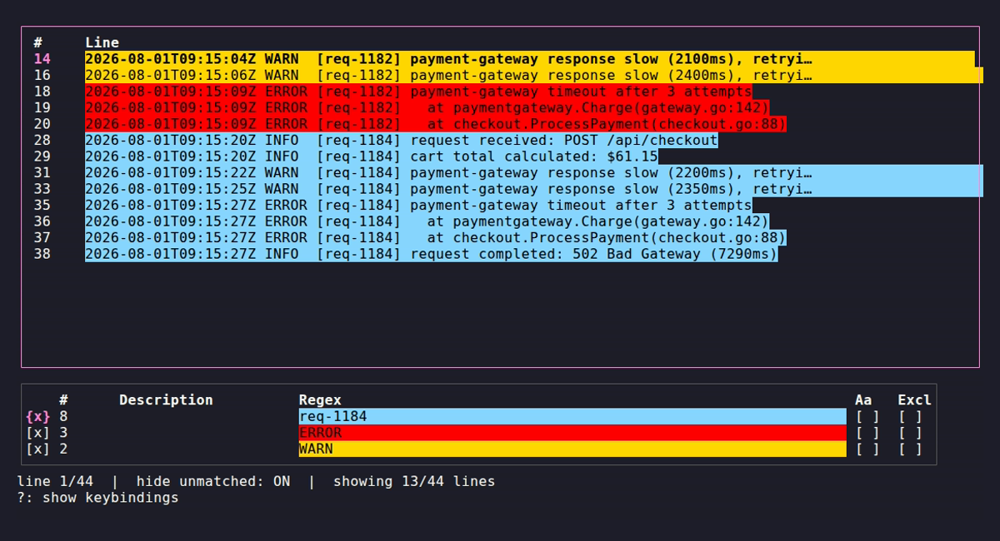

# Getting started

This page covers what you see when skim opens, how to move around, and the one habit — hiding unmatched lines — that makes filters actually useful. For how to build filters that find something specific, see the [tutorial](./tutorial-triage-a-log.md); for the full `.tat` format, see [filter files](./filter-files.md).

## Launching skim

skim takes two arguments: a log file to read, and a `.tat` filter file describing what to highlight in it.

```sh
skim -log path/to/your.log -filter path/to/your-filters.tat
```

Run with no arguments and skim opens against the bundled example log and filter file, so you can explore the UI without pointing it at anything of your own:

```sh
go run .
```

Pass `-log -` to read the log from stdin instead of a file, so skim can sit at the end of a pipeline instead of only working against something already saved to disk:

```sh
kubectl logs my-pod | skim -log - -filter path/to/your-filters.tat
```

skim reads all of stdin up front before the UI opens (the same as it does for a file), so this works with a finite stream (`kubectl logs` without `-f`, `cat`, ...) but won't show lines appended after that point — there's no live-tailing yet, and piping in a `-f`/follow stream would leave skim waiting forever for it to end before the UI ever opens. Keyboard input still works normally once the UI is up, piped log or not.

## The two panes

skim's screen is split into two panes, plus a status line and a help bar at the bottom:

```
┌────────────────────────────────────────┐
│  #     Line                            │   <- Log pane
│  1     Hello World!                    │
│  2     debug: this is a debug message  │
│  ...                                   │
└────────────────────────────────────────┘
┌─────────────────────────────────────────────────────────┐
│       #   Description        Regex          Aa    Excl  │   <- Filters pane
│  [x]  1                      ^debug         [ ]   [ ]   │
│  [x]  1                      goodbye        [ ]   [ ]   │
└─────────────────────────────────────────────────────────┘
hide unmatched: ON  |  showing 4/6 lines
q: quit  h: hide unmatched  K: keybindings
```

- **Log pane** (top) — every line of the log file, numbered, colored by whichever filter matched it.
- **Filters pane** (bottom) — one row per filter from your `.tat` file: an enabled checkbox, a live match count, the filter's description, its regex text (colored with that filter's own background color), and case-sensitivity/excluding checkboxes.

The pane with keyboard focus is outlined in a highlighted border (pink by default). Press `tab` to switch focus between them.

Here's that same layout rendered for real, mid-investigation — three filters isolating request errors, warnings, and one specific request's full lifecycle out of a much noisier log (this is the end state of the [tutorial](./tutorial-triage-a-log.md)):



## Moving around

These work in both panes:

| Key | Action |
| --- | --- |
| `up` / `k` | move cursor up |
| `down` / `j` | move cursor down |
| `tab` | switch focus between Log and Filters |
| `q` / `ctrl+c` | quit |

In the **Filters** pane, `left`/`h` and `right`/`l` move the cursor between the enabled, case-sensitivity, and excluding checkboxes for the selected filter, and `enter`/`space` toggles whichever one is selected.

The mouse wheel also scrolls the cursor up/down in whichever pane currently has focus.

This is the full default keymap — every action shown here can be rebound. See [keybindings](./keybindings.md).

## Hiding the noise

This is the core workflow the rest of the docs build on. Press `h` while the **Log** pane is focused to toggle `hide unmatched`:

- **ON** (the default) — only lines that match at least one *enabled* filter are shown.
- **OFF** — every line in the log is shown, with matching lines still colored.

The status line always tells you which mode you're in and how many lines are currently visible out of the total: `hide unmatched: ON | showing 4/6 lines`.

In practice this means: start with `hide unmatched` on and no filters (or all filters disabled) to see nothing, then enable filters one at a time to pull exactly the lines you care about out of the log. You never need to scroll past everything else to find them.

## Searching the log

Filters are for reusable, saved patterns. When you just want to find something *right now* without touching the filter file, press `/` in the Log pane, type a regex, and press `enter`. The cursor jumps to the first match after its current position, and the status line shows the active pattern (`search: /pattern/`).

Press `n` to jump to the next match and `N` for the previous one, wrapping around at either end of the log. Search scans every line regardless of `hide unmatched`, so it can find and jump to a match even if that line is currently hidden. `esc` while typing a pattern cancels without changing the current search.

## Context lines and match counts

Hiding unmatched lines is powerful but throws away sequence — you see the line that errored, but not what happened immediately before or after it. Press `+` in the Log pane to show a line of unmatched context on either side of every match (`grep -C` style); press it again to widen the radius, `-` to narrow it back down to 0. Context lines render plainly (uncolored), so they're easy to tell apart from an actual match. The current radius shows in the status line as `context: ±N` whenever it's non-zero.

The Filters pane's `#` column shows each filter's current match count — how many lines it's the one coloring, following the same first-enabled-filter-wins rule as highlighting (see [filter files](./filter-files.md#file-structure)). It updates live as you toggle filters, edit regexes, or the underlying counts otherwise change, and is a quick way to spot which filter is dominating a log before you've scrolled through it.

## Editing a filter live

With the **Filters** pane focused, move the cursor to a filter row and press `i` to open the filter editor. It's a form with one row per field — description, regex, case sensitivity, exclusion, enabled, and color:

- `up`/`k` and `down`/`j` move between fields.
- `enter` on **Description** or **Regex** starts typing; `enter` again confirms (recompiling the regex immediately — an invalid pattern stays in edit mode with the compile error shown instead of being discarded), `esc` discards just that field's in-progress edit. `ctrl+e` drops into `$EDITOR` with the field's current text, for anything long enough that a full editor is more comfortable than a single terminal line — press it right on the row without going through `enter` first, or mid-edit to switch over without losing what you've typed; either way, the result is applied the same way as `enter` on return.
- `enter`/`space` on **Case sensitive**, **Excluding**, or **Enabled** toggles it immediately.
- `enter` on **Color** opens a color picker: a grid of swatches you can move through with the arrow keys (or `hjkl`), click directly with the mouse, or press `c` to type an exact `#RRGGBB` hex value. `enter` or a click applies the color and returns to the form; `esc` backs out without changing it.
- `esc` from the field list closes the editor. Each field applies as soon as you confirm it, so there's no separate "save" step for the form itself — closing it just stops offering more fields to edit.

Pressing `a` inserts a new, disabled filter after the cursor and opens the same editor for it.

This is the fastest way to iterate when you don't yet know the exact pattern you're looking for: tweak the regex, look at what now matches, tweak again.

## Next steps

- Walk through a realistic investigation end-to-end in the [tutorial](./tutorial-triage-a-log.md).
- Learn the full `.tat` filter file format in [filter files](./filter-files.md), including colors and case sensitivity.
- Customize or look up every action in [keybindings](./keybindings.md).
